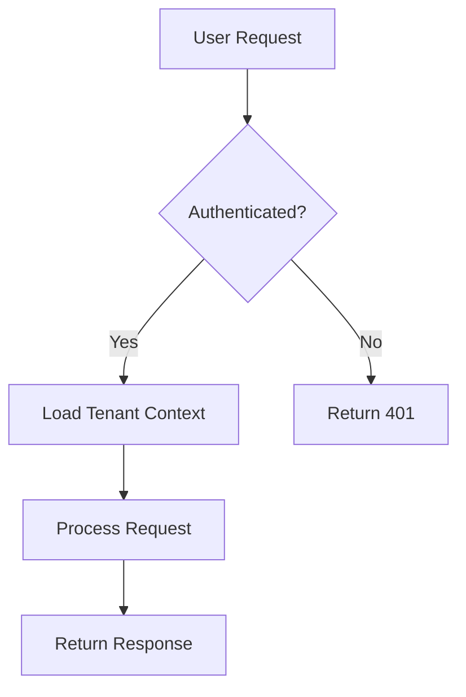

# Documentation Instructions

You are creating documentation for Software Developers. Focus on clarity, maintainability, and version-aware content.

## Version Management Pattern

Always reference source files for versions to prevent outdated documentation:

```markdown
# Good ✅
- Ruby version specified in `.ruby-version`
- Dependencies listed in `Gemfile`
- Database configuration in `config/database.yml`

# Avoid ❌
- Ruby 3.2.0
- Rails 8.0.2
- Embedding template content directly in documentation
```

## Visual Elements

### Mermaid Diagrams
Use for architecture and flow visualization:



### Tables
For structured data presentation:
```markdown
| Configuration | Default | Description       |
| ------------- | ------- | ----------------- |
| `timeout`     | 30s     | Request timeout   |
| `retry_count` | 3       | Number of retries |
| `log_level`   | info    | Logging verbosity |
```

## Writing Guidelines

### Structure
- Use clear, descriptive headings
- Include table of contents for all documents (especially >100 lines)
- Group related content under appropriate sections
- End with troubleshooting or FAQ when applicable
- Avoid acronyms

### Table of Contents Requirements

**All documentation files should not include a table of contents** since GitHub has this feature built-in.

#### Table of Contents Best Practices
- **Use descriptive section names** that clearly indicate content
- **Include key topics** in the description column for enhanced tables
- **Link to both internal sections** using `#anchor` and external files using `file.md`
- **Group related sections** logically in the table
- **Use emojis sparingly** in quick reference tables for visual categorization
- **Ensure all headings match** the table of contents links exactly
- **Test all links** to verify they work correctly
- **Exclude document titles** (# heading) from table of contents - focus only on sections (## headings and below)
- **Exclude "Table of Contents" heading** itself in the TOC listing
- **Document titles should not be navigation elements** - they serve as page identification, not sectional navigation

## Code Examples
- Test all code examples before documenting
- Include context and expected output
- Use realistic data that matches domain model
- Show both success and error cases

## Maintenance
- Link to source files for versions
- Avoid duplicating information from code
- Reference external docs for generic concepts
- Focus on project-specific patterns
- Reference existing files instead of embedding content

## Quick Reference

### Documentation Checklist
- [ ] Versions reference config files (not hardcoded)
- [ ] Code examples tested and working
- [ ] Structure appropriate for document type
- [ ] Links to external resources functional
- [ ] Project-specific patterns documented
- [ ] No outdated version numbers
- [ ] Clear prerequisites stated
- [ ] Troubleshooting section included (if applicable)

### Writing Standards
- [ ] Clear, descriptive headings used
- [ ] Table of contents for long documents
- [ ] Code examples include context
- [ ] External links are functional
- [ ] Mermaid diagrams for complex flows
- [ ] Tables for structured data

### Table of Contents Standards
- [ ] All documents include table of contents (especially >100 lines)
- [ ] Enhanced table format used for complex documents
- [ ] Section names are descriptive and clear
- [ ] Key topics included in description column
- [ ] All heading links match actual headings exactly
- [ ] Internal links use `#anchor` format
- [ ] External links use `file.md` format
- [ ] Quick reference tables for operational docs

## Resources
- [Markdown Guide](https://docs.github.com/en/get-started/writing-on-github) - Syntax reference
- [Mermaid Docs](https://mermaid.js.org/) - Diagram syntax